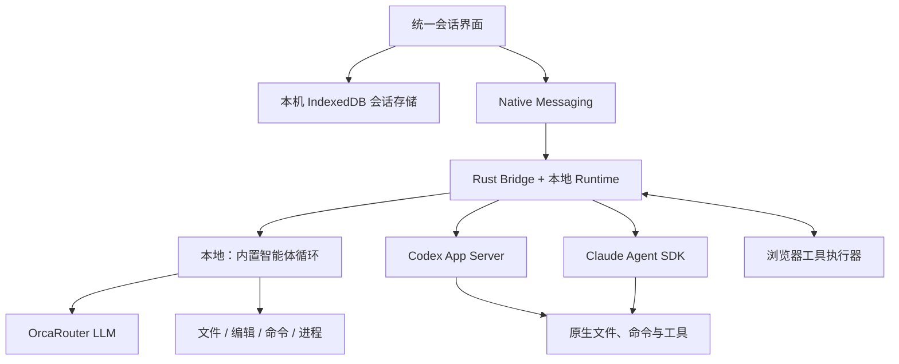

# WebAgentMate v0.6：完整智能体与本机会话

本方案依据当前用户要求，取代 v0.4/v0.5 中只读 CLI、固定五种动作及 Bridge 仅用于存储的限制。实现与验收以本文件为准。

## 1. 必须实现的产品能力

1. 一个持续工作的智能体：理解目标、规划、调用工具、检查结果、调整行动、验证并完成任务。
2. 所有智能体通过本机 Bridge 运行，可选择 Codex、Claude Code 或调用 OrcaRouter 的内置智能体。
3. 浏览器界面负责会话和浏览器工具，经 Native Messaging 与本机智能体通信；移除远端执行模式。没有 Bridge 时可管理会话与草稿，但不能启动任务。
4. 会话仅在当前设备持久化。每个会话拥有独立的历史、草稿、模型、工作目录和原生智能体会话身份，不做跨设备同步。

“本地”描述运行环境和工具执行位置，不表示模型离线推理。内置智能体实现同类工具和执行机制，任务质量取决于所选模型。Codex、Claude 保留其原生执行循环。

## 2. 架构

模型选择与工具执行分离。所有引擎向 UI 输出统一的文本、工具开始/结束、询问、计划、状态和会话事件。内置引擎同时提供完整工具调用记录及上下文检查点。

## 3. 执行路径与能力

| 能力 | 本地内置 | 本地 Codex / Claude |
|---|---|---|
| 连续对话、流式输出、工具循环 | 本机 Runtime 循环 | 原生循环 |
| 页面读取、多标签页、导航、表单与滚动 | 请求扩展执行 | 动态工具 / MCP 请求扩展执行 |
| 页面截图 | 视觉模型可用 | 通过原生多模态工具结果 |
| 生成可下载文档 | 可用 | 可用 |
| 工作目录内文件读取、搜索、编辑 | Runtime 执行 | 原生工具执行 |
| 系统命令与进程管理 | Runtime 执行 | 原生工具执行 |
| 计划与必要的用户询问 | 共用工具 | 原生事件与共用工具 |
| 持久化与继续对话 | IndexedDB 历史 | IndexedDB + 原生会话 ID |

浏览器工具必须实际执行并返回结果；工具名称、参数和描述使用同一份定义。只向模型暴露当前引擎实际可执行的能力。原生系统页面、未授权网页和受保护控件返回明确的能力错误。

## 4. 工具设计

- 浏览器：列出标签页、读取分页文本与可交互元素、导航、点击/填写/选择/滚动、截图、等待。
- 通用：任务计划、必要的用户询问、生成 Markdown/文本/CSV 文档。
- 本地内置：目录浏览、分段读取、搜索、创建/编辑文件、精确补丁、命令启动、读取进程输出、终止进程。
- 工具参数必须按 schema 校验；不可用工具、过期页面元素、工作目录越界和失败的系统操作均返回错误，交由模型修正。
- 普通问答无需读取当前页面。模型获得本轮环境的实际工具集合。
- 浏览器工具以可组合操作为基础，网站专用 API 可在后续通过同一工具接口扩展。

## 5. 任务生命周期与恢复

状态包括准备、请求模型、执行工具、等待用户、压缩上下文、完成、失败、中断。

- 用户停止和关闭侧栏必须取消模型读取及当前 Runtime，并终止该次运行拥有的进程。
- 请求应有连接/首字节及流空闲超时；超时应显示原因，不能无限显示 Working。
- 暂时性模型连接失败可以有限重试，但已执行的工具不得因此重放。部分输出、工具参数未完成或副作用结果未知时，保留明确的中断记录。
- 内置循环在上下文接近预算时生成摘要，保留当前目标和最近完整工具调用组；压缩也必须能超时、取消及报告失败。
- Native Messaging 传递大历史或图片时采用有序分片；超限、缺片、乱序、断线必须可诊断，不能悄然丢失检查点。
- 原生引擎的工具调用、授权、会话恢复和结束状态必须通过真实协议验证。

## 6. 会话管理

- 创建、列表、切换、搜索、重命名和删除。
- 保存聊天、工具输入/结果、草稿、模型/引擎/环境/工作目录以及原生 session ID。
- 重启浏览器后恢复上次所选会话；继续原生会话时复用该会话自身的 ID。
- 手动创建分支或更改引擎/环境/工作目录时创建新身份，保留原会话和上下文。
- 导出/导入 JSON 备份。导入恢复新的会话，不自动执行任务，不接管外部原生 session ID，不导出应用连接设置。
- 同一会话不能由两个窗口同时执行；过期运行可恢复，迟到事件不能写入新运行或已删除会话。
- 删除仅清理扩展保存的副本。分支副本、用户导出的文件、原生智能体历史和生成的工作文件分别管理。

## 7. 模型与权限

- OrcaRouter 模型目录提供模型、价格和上下文能力；检查工具调用和图片能力，避免把不支持的输入交给模型。
- 不自动切换到收费模型。认证、额度、上下文和网络错误提供可恢复提示。
- 本地 Codex/Claude 使用用户已安装程序和相应认证。Bridge 不把浏览器连接密钥写入磁盘或传给任意 Shell 子进程。
- 读取操作可直接执行；写文件、系统命令和网页变更按执行器权限策略处理，并展示具体目标与操作。
- 页面、文件、导入历史和工具返回内容都作为数据，不得覆盖用户目标和工具权限。

## 8. 交付与验证

2026-09-08 界面要求：使用 antd 交互组件；Agent 在页头、欢迎页和回复旁有头像；会话列表从左侧抽屉展开；设置页仅保留连接、外观和关于；模型按服务商 → 模型级联并支持搜索、标明免费/付费；本地模式在输入框底部选择或浏览工作目录。OrcaRouter 同时支持浏览器授权和验证 API Key 后连接；授权成功的保存与公开模型列表加载相互独立。

交付源码、统一方案、构建后的扩展、可安装的本地 Bridge/runtime，以及可重复执行的自动化检查。发布到商店、GitHub 或第三方平台不属于本次自动执行范围。

| 验收项 | 所需证据 |
|---|---|
| 内置循环能连续调用工具并依据结果回答 | 可重复的模拟协议测试 + OrcaRouter 真实两步任务 |
| 本地内置能编辑并验证工作文件 | 临时工作目录内读/编辑/命令实际结果 + 真实模型任务 |
| Codex 完整接入 | 原生模型目录、动态浏览器工具、两轮恢复、停止与失败事件的真实运行 |
| Claude 完整接入 | 原生模型目录、MCP 浏览器工具、两轮恢复、停止与失败事件的真实运行 |
| 仅本地运行与浏览器工具 | 无 Bridge 时保留草稿并阻止启动；浏览器工具经 Native Messaging 返回本机智能体 |
| 会话管理 | 存储/分支/备份/竞争测试及真实浏览器界面操作 |
| 超时、压缩和传输恢复 | 可控故障、长历史、图片、丢片/乱序和取消测试 |
| 安装包可运行 | Runtime 与 Bridge 构建、打包完整性、Native Messaging 握手和安装检查 |
| 产品界面与说明一致 | 六种语言、构建、界面验证，以及 README/隐私/商店说明更新 |

最终验收记录写入 `docs/ACCEPTANCE-v0.6.md`，逐项列明命令、真实或模拟环境、结果与尚未完成项。模型目录成功或单次文本回答不能代替完整工具循环与恢复验证。

## Codex 兼容性扩展（2026-09-08）

本地 Codex 使用原生配置和指令，支持推理/模式/权限选项、运行中追加、原生历史分支、Skills/MCP 目录与交互、计划/变更/用量显示。具体范围、真实验证和剩余限制见 [Codex 兼容性](CODEX-COMPATIBILITY.md)。

## 内置长任务和独立页面（2026-09-08）

- 本地内置智能体默认不限工具调用次数和整轮时长，保留单次模型请求超时、取消和上下文整理。旧会话的 `maxSteps` 不再自动成为内置上限；会话配置中的“限制工具调用次数”需要显式开启，并随备份保存。Claude 原生轮次配置维持现状。
- 内置运行连续 8 次工具失败，或最近 12 次调用重复长度为 1 至 4 的相同操作及结果序列时暂停。忽略网页快照 ID 等易变标识，比较实际结果及图片；仍在运行的本地进程轮询不参与重复检测。检测属于启发式保护，用户可检查结果、调整指示后继续。
- 达到可选上限或触发检测时保存工具结果，将同批尚未执行的调用明确标记为未执行，不自动重放，也不自动执行队列中的下一条消息。
- 顶栏“在独立页面打开”在浏览器标签页打开当前会话；先保存草稿，复用该会话已打开的页面，避免重载正在运行的连接。页面切换会话后更新地址，刷新恢复该会话。与侧栏共享既有进度、草稿、回复与停止机制。
- 独立页面占满浏览器内容区的宽度和高度，不沿用侧栏的 900px 最大宽度；消息、工具结果和输入框使用可用空间，窄窗口保持自适应。
- 打开独立页面本身不关闭任务发起页面，也不转移运行连接。关闭任务发起页面时仍遵循现有停止与恢复机制；在独立页面发起的任务可以在关闭侧栏后继续。

## 仅本地运行与 OrcaRouter 错误交互（2026-09-08）

- 移除运行位置切换和会话环境筛选，三种引擎统一使用 Bridge。保留远端配置值仅用于兼容旧数据库和备份；执行入口拒绝远端配置。旧浏览器推理端点和旧远端任务批准入口关闭。
- 旧远端内置会话原地迁移，保留 ID、历史、草稿、模型、预算、排队消息和运行所有权；加载不执行任务。原浏览器自动授权重置为询问，本地配置原有授权偏好不变。
- OrcaRouter 错误解析遵循 [错误说明](https://docs.orcarouter.ai/operations/errors)、[请求频率限制](https://docs.orcarouter.ai/operations/rate-limits) 和 [免费模型限制](https://docs.orcarouter.ai/routing/free-models)。错误说明与操作保存在会话中并跨窗口同步；旧原始错误也在展示时转为可读说明。
- 免费档 429 有 Retry-After 时显示恢复时间和倒计时重试；明确没有该头时提示单次输入过长，提供新建短会话、切换模型与免费限制说明。旧错误未保存响应头时明确原因尚不能区分，不伪造重试时间。
- 分别说明工作空间余额、Key 配额、成员/智能体月预算、Key 周期消费上限、模型权限与服务不可用，提供相应控制台、连接或模型入口。不会自动充值、切换付费模型或绕过限流。周期上限若有服务商给出的 UTC 重置时间，显示本机时区时间。
- 只在用户点击后继续已保存的任务或切换配置；已执行工具不自动重放。所有操作链接固定为官方地址，不采用错误响应中的任意 URL。
